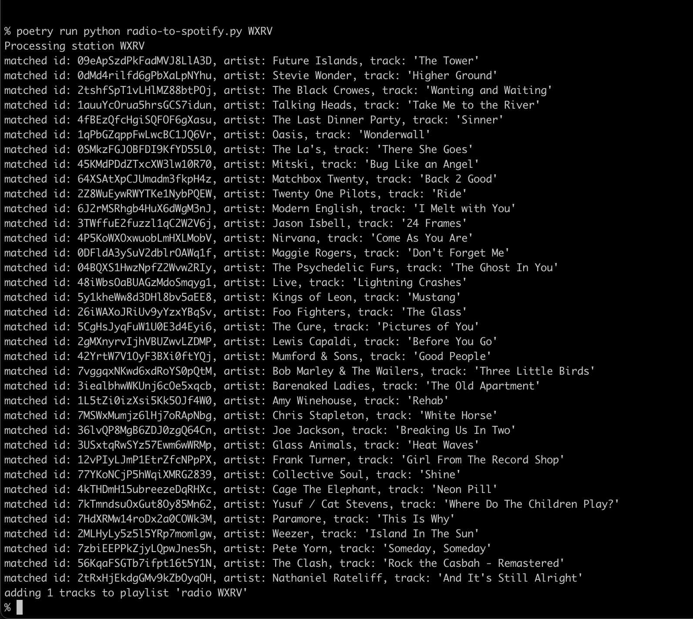

# radio-to-spotify

## Overview

A tool to scrape the "recently played" lists of radio stations and add them to a Spotify playlist.



## Preparation
### Getting your Spotify credentials

* You'll need to create a Spotify application at [their developer site](https://developer.spotify.com/dashboard).
* Set the "redirect URI" of the application to `http://localhost:4242/`
* From the "settings" section of your application, pull the client ID and client secret

### Set your environment
You'll need `SPOTIFY_CLIENT_ID`, `SPOTIFY_CLIENT_SECRET` and `SPOTIFY_USERNAME` set in your environment before running.

## Running it

You can pick your virtual environment manager of choice, but I use `poetry` like so:

`poetry run python radio-to-spotify.py -h`

### Listing known stations

`poetry run python radio-to-spotify.py --list_stations`

### Updating a station's playlist

`poetry run python radio-to-spotify.py WXRV`

## Adding new stations

* Make a copy of an existing station in `./stations`
* Tweak it to parse their "recently played" page
* Make sure to return a list of dicts with "track_name" and "artist_name" as keys
* It should magically appear in the `--list_stations` output

## Authors

* **Luke Hankins** - [lukehankins](https://github.com/lukehankins)

## License
```
Please refer to LICENSE or <http://unlicense.org/>
```
